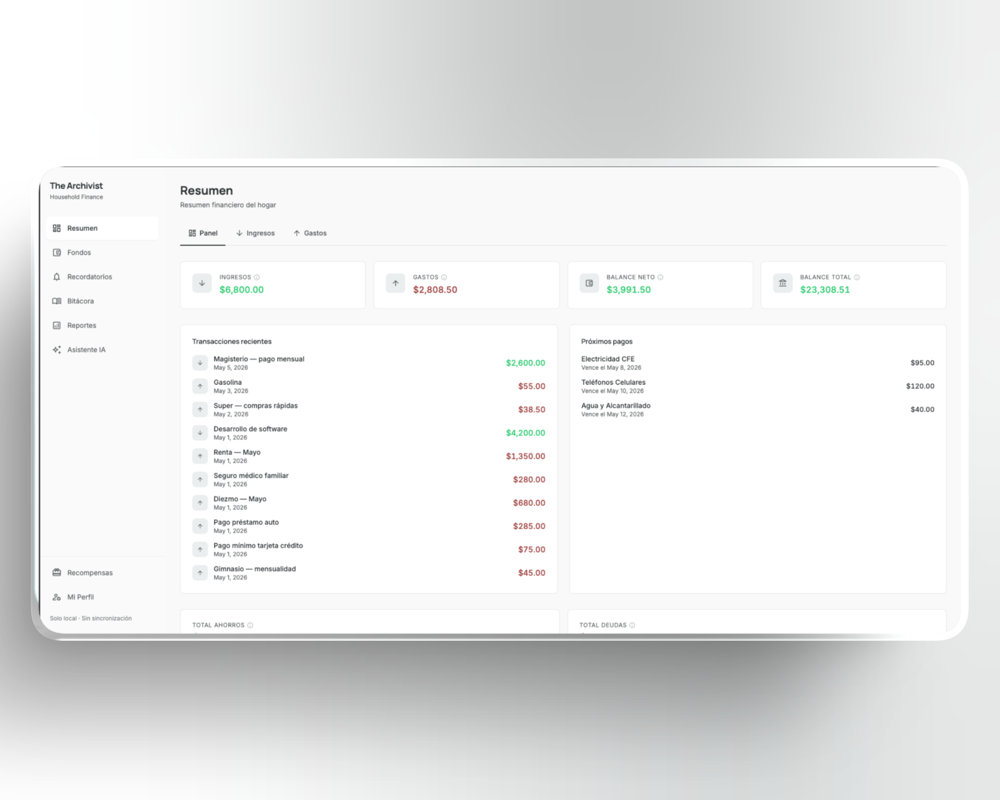
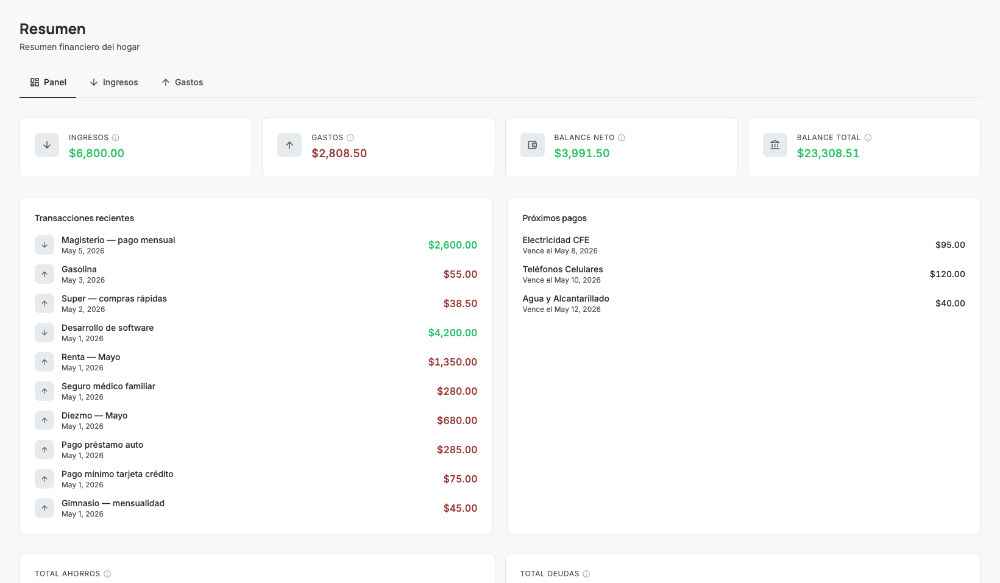
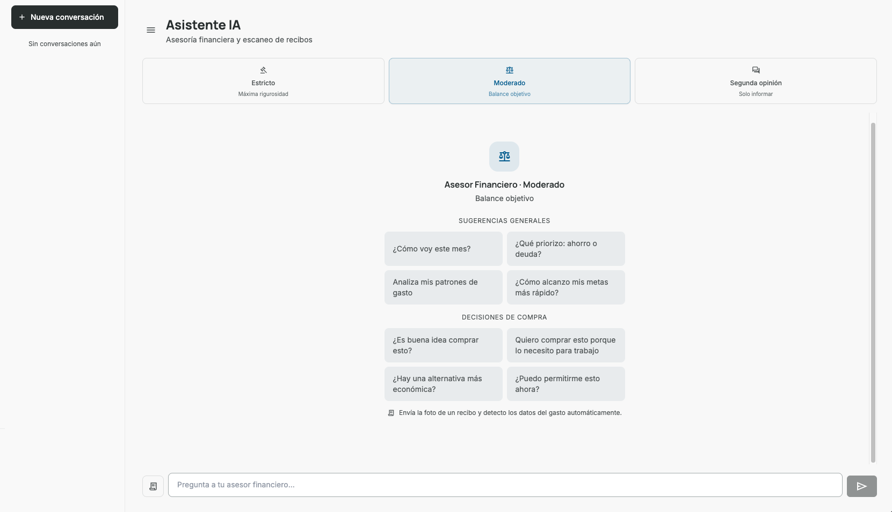
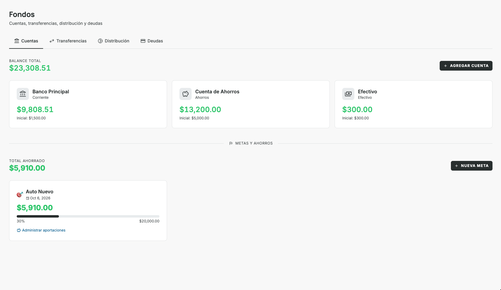
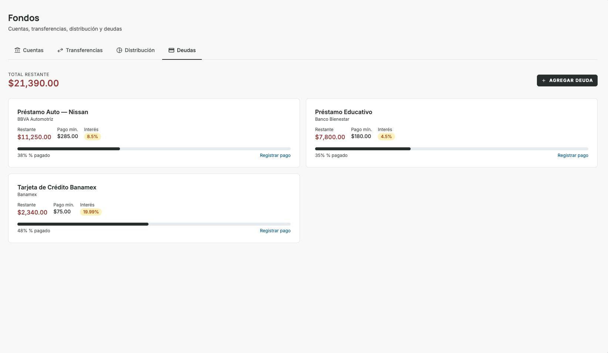
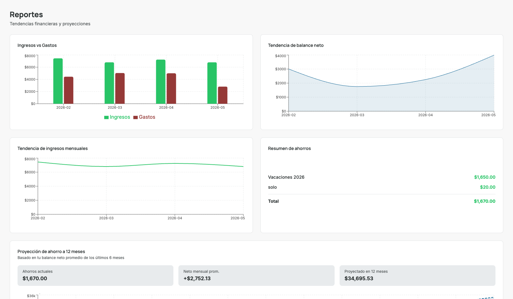
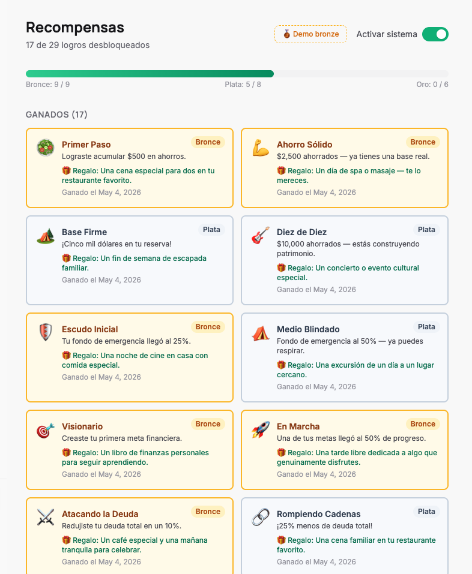
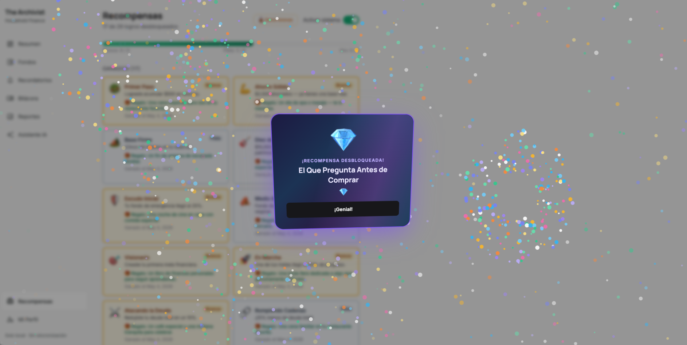

# The Archivist

> Self-hosted personal finance manager with AI advisor, goal tracking, debt management, and an achievement rewards system.



<p align="center">
  
  
  
  
  
  
</p>

---

## Overview

The Archivist is a **local-first** finance app designed for people who want full control of their financial data — no subscriptions, no cloud sync, no third-party access. All data lives in a single SQLite file on your machine.

It covers the full personal finance loop: logging transactions, tracking goals and debts, projecting savings, and getting AI-powered advice — all from a clean, responsive interface available in English and Spanish.

---

## Screenshots

### Dashboard


### AI Financial Advisor


### Goals & Savings


### Debts


### Financial Reports


### Rewards & Achievements


### Celebration Modal


---

## Features

### 💰 Accounts & Transfers
- Create and manage multiple bank accounts with current balances
- Record transfers between accounts with date and notes
- Visual account cards with balance overview

### 📊 Income & Expenses
- Full CRUD for income and expense transactions
- Custom categories with icons
- Filter and search by date, category, and amount
- Bulk import via CSV

### 🎯 Goals & Savings
- Create savings goals with target amount and optional deadline
- Track progress with a visual progress bar
- Log contributions and deletions with automatic balance updates
- View full contribution history in a dedicated modal

### 💳 Debts
- Track credit cards and loans with outstanding balance and minimum payment
- Optional billing cycle fields: billing cutoff date and payment due day
- Payment history log
- One-click reminder creation as a fixed expense

### 📅 Fixed Expenses & Reminders
- Recurring bills with frequency settings (monthly, weekly, etc.)
- Reminder list view grouped by upcoming due date

### 📈 Financial Reports
- Income vs. expenses bar chart by month
- Net balance trend area chart
- Monthly income trend line chart
- Savings fund overview
- 12-month savings projection based on average net income
- **Persistent AI-generated analysis** — regenerate anytime, stored with timestamp

### 🤖 AI Financial Advisor
- Conversational chat powered by [Groq](https://console.groq.com) (llama-3.3-70b)
- **7-day persistent chat history** with conversation sidebar
- Three advisor modes: Strict, Balanced, Motivational
- Receipt scanning via vision model — attach a photo and it auto-creates the expense
- Context-aware: the AI reads your actual accounts, goals, debts, and expenses

### 🏆 Rewards & Achievements
- Achievement system with Bronze, Silver, Gold, and Diamond tiers
- Unlocked automatically based on financial behavior
- Diamond cards feature a rainbow holographic border with tilt effect
- **Celebration modal** with tier-specific fireworks animations when an achievement unlocks
- Toggle rewards on/off from the rewards page

### 🌍 Internationalization
- Full English and Spanish support
- Language switcher in profile settings

### 📓 Journal
- Personal finance notes and reflections

### 📦 Budget Distribution
- Allocate income percentages across accounts automatically

---

## Tech Stack

| Layer | Technology |
|-------|------------|
| **Frontend** | React 18, TypeScript, Vite, Tailwind CSS |
| **State & Data** | TanStack Query (React Query) |
| **Animations** | Framer Motion |
| **Charts** | Recharts |
| **Backend** | FastAPI, Python 3.9+, SQLModel |
| **Database** | SQLite (local file) |
| **AI** | Groq API — `llama-3.3-70b-versatile` + `llama-3.2-11b-vision-preview` |
| **Package managers** | `pnpm` (frontend), `uv` (backend) |

---

## Getting Started

### Prerequisites

- Python 3.9+
- Node.js 18+ with [pnpm](https://pnpm.io/installation)
- [uv](https://docs.astral.sh/uv/) (recommended) or pip
- A free [Groq API key](https://console.groq.com) for AI features

---

### 1. Clone the repository

```bash
git clone https://github.com/mrescobar02/archivist.git
cd archivist
```

---

### 2. Backend setup

```bash
cd backend

# Install dependencies
uv sync

# Configure environment
cp .env.example .env
```

Edit `backend/.env` and set your Groq API key:

```env
GROQ_API_KEY=your_groq_api_key_here
```

---

### 3. Frontend setup

```bash
cd frontend

# Install dependencies
pnpm install

# Configure environment
cp .env.example .env
```

The default `.env` points to `http://localhost:8000` — no changes needed for local development.

---

### 4. Run

From the project root, open two terminals:

```bash
# Terminal 1 — backend
make backend

# Terminal 2 — frontend
make frontend
```

- API: `http://localhost:8000` · Docs: `http://localhost:8000/docs`
- App: `http://localhost:5173`

---

## Environment Variables

### Backend (`backend/.env`)

| Variable | Required | Default | Description |
|----------|----------|---------|-------------|
| `GROQ_API_KEY` | For AI features | — | Your Groq API key |
| `GROQ_MODEL` | No | `llama-3.3-70b-versatile` | Chat model |
| `GROQ_VISION_MODEL` | No | `llama-3.2-11b-vision-preview` | Receipt scanning model |
| `GROQ_MAX_TOKENS` | No | `1024` | Max tokens per response |
| `DATABASE_URL` | No | `sqlite:///./archivist.db` | Database path |
| `BACKEND_PORT` | No | `8000` | Server port |
| `CORS_ORIGINS` | No | `http://localhost:5173` | Allowed frontend origins |
| `UPLOAD_DIR` | No | `./uploads/receipts` | Receipt image storage |

### Frontend (`frontend/.env`)

| Variable | Required | Default | Description |
|----------|----------|---------|-------------|
| `VITE_API_URL` | No | `http://localhost:8000` | Backend base URL |

> AI features (advisor chat, receipt scanner, financial analysis) are gracefully disabled if `GROQ_API_KEY` is not set. All other features work without it.

---

## Project Structure

```
archivist/
├── backend/
│   ├── app/
│   │   ├── models/          # SQLModel table definitions
│   │   ├── routers/         # FastAPI route handlers
│   │   ├── schemas/         # Pydantic request/response schemas
│   │   ├── services/        # Business logic (AI, rewards, seeding)
│   │   ├── core/            # Config and settings
│   │   └── db/              # Database session and setup
│   ├── main.py              # App entrypoint + startup migrations
│   ├── requirements.txt
│   └── .env.example
│
├── frontend/
│   └── src/
│       ├── components/      # Shared UI (primitives, layout, feedback)
│       ├── hooks/           # React Query data hooks
│       ├── pages/           # Page components by route
│       ├── services/        # API client functions
│       ├── store/           # Zustand UI state (toasts, modals)
│       ├── types/           # TypeScript interfaces
│       └── i18n/            # Translation files (en, es)
│
└── README.md
```

---

## Adding Sample Data

A seed script is included to populate the app with realistic demo data:

```bash
cd backend
uv run python demo_seed.py
```

---

## Data & Privacy

- **Everything is local.** No accounts, no telemetry, no external servers (except Groq API calls when AI features are used).
- Your data lives in `backend/archivist.db` — a single SQLite file you can back up, move, or delete at any time.
- Receipt images are stored in `backend/uploads/receipts/`.

---

## License

This project is licensed under the **Business Source License 1.1 (BUSL-1.1)**.

**You are free to:**
- Use for personal, educational, internal business, or evaluation purposes
- Copy, modify, and create derivative works

**You may NOT, without written permission:**
- Offer this software as a hosted or managed service
- Build competing SaaS platforms or commercial derivatives
- Resell, sublicense, or redistribute commercially
- Deploy in multi-tenant production environments for third parties

Organizations generating more than **$1,000,000 USD/year** in revenue must obtain a commercial license for production use.

On **January 1, 2030**, the license automatically converts to the [Apache License 2.0](https://www.apache.org/licenses/LICENSE-2.0).

See the full [`LICENCE`](./LICENCE) file for details. For commercial licensing inquiries contact **Isaac Escobar**.

---

<p align="center">Built with FastAPI + React · Local-first · No cloud required</p>
